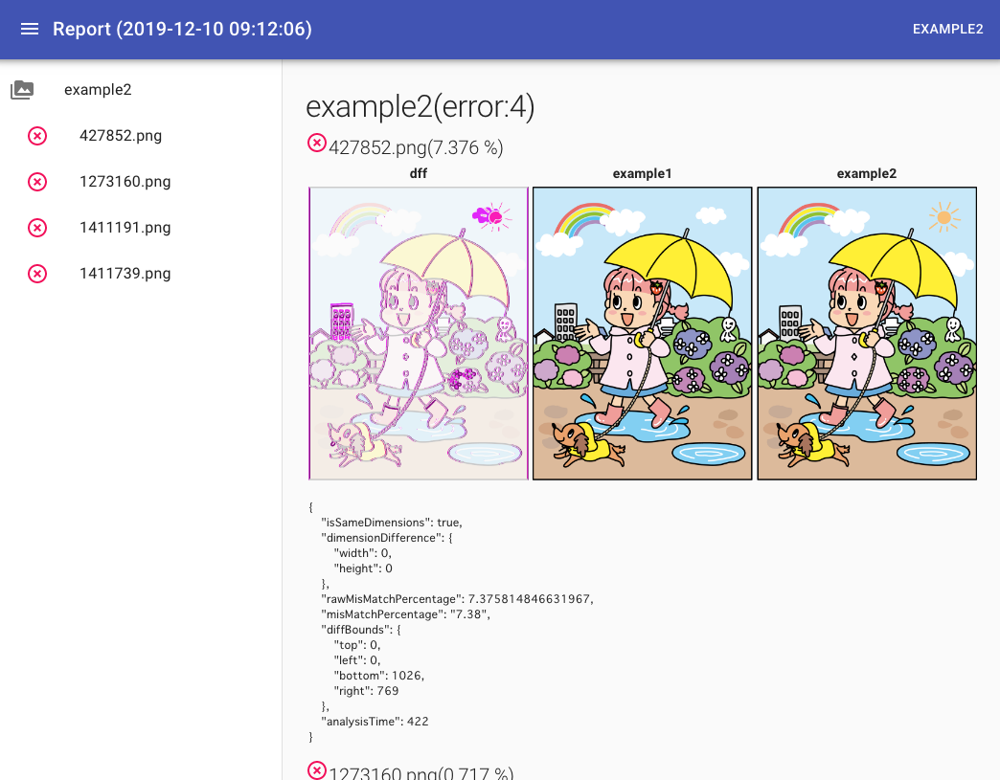

# Image Report

<p align="center">
    
</p>

[](https://travis-ci.com/ateliee/img-report)
[](https://coveralls.io/github/ateliee/img-report?branch=master)
[](https://badge.fury.io/js/img-report)
[](https://www.codacy.com/manual/ateliee/img-report?utm_source=github.com&amp;utm_medium=referral&amp;utm_content=ateliee/img-report&amp;utm_campaign=Badge_Grade)


Extract image differences between directories and output HTML reports

## Demo



[Try Now!](https://ateliee.github.io/img-report/)

## Usage

* Node <= 8.16.2
* [webpack 4.41.2](https://webpack.js.org/)
* [React 16.12.0](https://ja.reactjs.org/)
* [Redux 4.0.4](https://redux-docs.netlify.com/)
* [Resemble.js](https://github.com/rsmbl/Resemble.js)
* [Material-UI](https://material-ui.com/)

### for Development

* [ESlint](https://eslint.org/)
* [Mocha](https://mochajs.org/)
* [Chai.js](https://www.chaijs.com/)

## Install
```
npm install ateliee/img-report --save-dev
```

## Howto

### diff image directory reporting
```
img-report diff ./assets ./dist
# clear ./dist and reporting
img-report diff ./assets ./dist -f
# and reporting html
img-report diff ./assets ./dist -r
# config setting
img-report diff ./assets ./dist -c config.json
```

#### config parameters examples(see Resemble.js)

```
{
  "Resemble": {
    "errorColor": {
      "red": 0,
      "green": 255,
      "blue": 0,
      "alpha": 255
    },
    // flat|movement|flatDifferenceIntensity|movementDifferenceIntensity|diffOnly
    "errorType": "movement",
    "transparency": 0.2,
    "largeImageThreshold": 1200,
    "useCrossOrigin": false,
    "outputDiff": true
  }
}
```

### Output Image Dir Report

```
img-report build -s ./assets/ -d ./dist/
```

create current directory .img-report

### report dev server start
```
img-report serve -s ./assets/ -d ./dist/
```

## For Development

pre-commit lint and unit testing.

### lint
```
npm run-script lint
npm run-script lint:fix
```

### unit test
```
npm test
```

## Exmaple Images

* [Illust AC](https://www.ac-illust.com/)