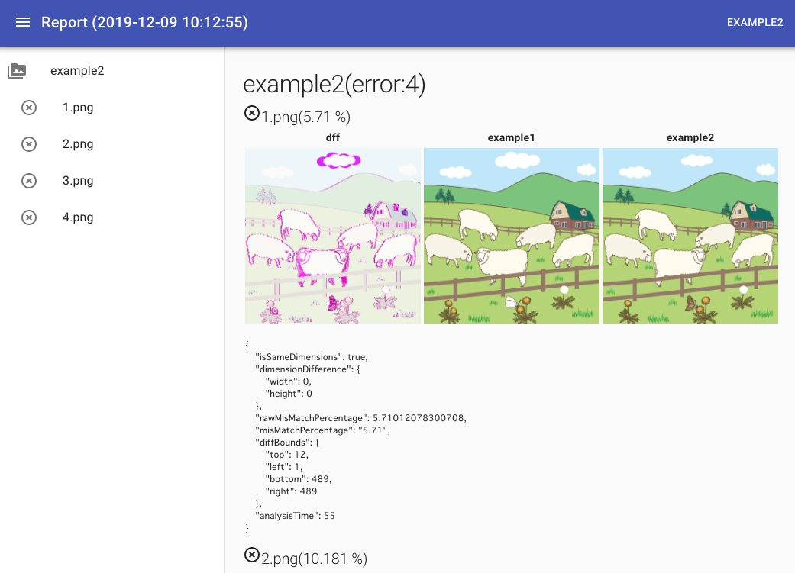

# Image Report

Extract image differences between directories and output HTML reports



## usage
* Node 10.13.*
* [webpack 4.41.2](https://webpack.js.org/)
* [React 16.12.0](https://ja.reactjs.org/)
* [Resemble.js](https://github.com/rsmbl/Resemble.js)
* [Material-UI](https://material-ui.com/)

## install
```
npm install ateliee/img-report --save-dev
```

## howto

### diff画像作成
```
img-report diff ./assets ./dist
# 出力フォルダをクリア
img-report diff ./assets ./dist -f
# reportも合わせて出力
img-report diff ./assets ./dist -r
```

### レポート出力

```
img-report build -s ./assets/ -d ./dist/
```

.img-reportが現在のディレクトリに作成されます。

### サーバー起動
```
img-report serve -s ./assets/ -d ./dist/
```

### exmaples

* [Illust AC](https://www.ac-illust.com/)